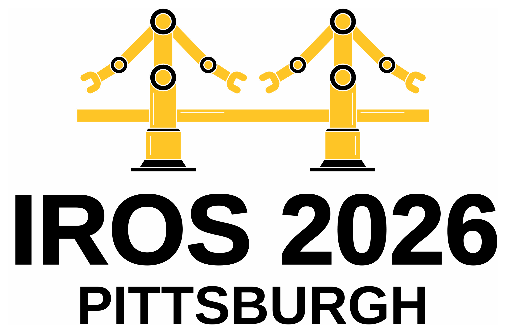
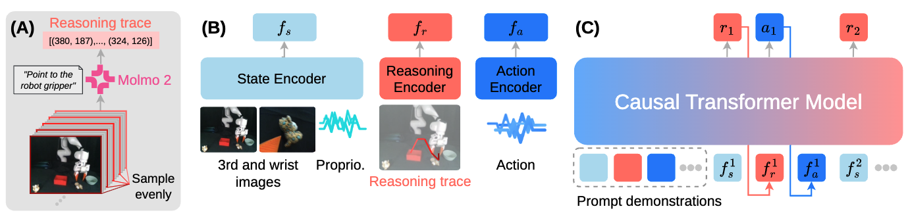

<div align="center">

# ICLR: In-Context Imitation Learning with Visual Reasoning



**Accepted at IROS 2026 — Pittsburgh, USA**

[](https://toannguyen1904.github.io/ICLR/)
[](https://arxiv.org/abs/2603.07530)

</div>

This repo contains the official implementation of ***ICLR: In-Context Imitation Learning with Visual Reasoning***, accepted to the IROS 2026 conference.

<p align="center">
  
</p>

<!-- > **⚠️ This repo is still being updated frequently — stay tuned.** The current version supports training and inference on the LIBERO benchmark. -->

## 🛠️ Setup
```bash
# download repo
git clone --recurse-submodules https://github.com/toannguyen1904/ICLR.git
cd ICLR

# create the environment and install packages with uv
uv python pin 3.10
uv sync
```
`uv sync` installs the `iclr` package itself and the `libero` package (from the `LIBERO` submodule) as editable dependencies — no separate `pip install -e` steps needed.

Verify the GPU is visible:
```bash
uv run python -c "import torch; print(torch.__version__, torch.cuda.is_available())"
```

## 👁️ Download the Pretrained Vision Encoder
You can download the pretrained vision encoder (originally provided by [Fu et al. 2025](https://icrt.dev/)) by running:
```bash
hf download nanidafvck/ICLR_vision_encoder --local-dir ./vision_encoder/
```

## 🕹️ LIBERO Simulation
### 🗂️ Preparing LIBERO Datasets
*Make sure you added the LIBERO submodule (`git submodule update --init`) and ran `uv sync` before following steps*

#### 1. LIBERO Configuration

We use our own fork of LIBERO ([toannguyen1904/LIBERO](https://github.com/toannguyen1904/LIBERO)) as the submodule instead of upstream, since it already includes a few fixes needed for this repo:
- the `__init__.py` files upstream is missing (a known, still-open bug, see [PR #15](https://github.com/Lifelong-Robot-Learning/LIBERO/pull/15)), which otherwise causes `setup.py`'s `find_packages()` to silently discover zero packages
- `weights_only=False` on its `torch.load` calls, required since PyTorch 2.6 flipped that default and LIBERO's init-state/checkpoint files aren't tensor-only pickles
- a default config path of `~/ICLR/libero_config.yaml`

None of that needs manual setup anymore — `uv sync` installs `libero` as an editable dependency automatically. If you cloned this repo somewhere other than `~/ICLR`, set the `LIBERO_CONFIG_PATH` environment variable to your repo root instead of relying on the default.

Create your local config file (this is machine-specific and not checked into the repo):
```bash
touch libero_config.yaml
```

Then edit it:
```yaml
assets: your_ICLR_folder/LIBERO/libero/libero/assets
bddl_files: your_ICLR_folder/LIBERO/libero/libero/bddl_files
benchmark_root: your_ICLR_folder/LIBERO/libero/libero
datasets: your_desired_LIBERO_datasets_location
init_states: your_ICLR_folder/LIBERO/libero/libero/init_files
```

#### 2. Download LIBERO-Object and LIBERO-90
Run following commands to download two LIBERO datasets used in ICLR
```bash
cd LIBERO
# LIBERO-Object
python benchmark_scripts/download_libero_datasets.py --datasets libero_object

# LIBERO-90. Here we download LIBERO-100 since LIBERO-90 is a part of LIBERO-100
python benchmark_scripts/download_libero_datasets.py --datasets libero_100
```

After downloading successfully, you should see the confirmation that LIBERO-Object, LIBERO-90, and LIBERO-10 are complete. However, as mentioned earlier, we don't need LIBERO-10, so you can just go delete it.

#### 3. Preprocess LIBERO Datasets
In this step, we regenerate the LIBERO datasets to remove no-op actions and unsuccessful episodes. Basically, we follow OpenVLA's preprocessing.
```bash
cd ../tools
# LIBERO-Object
python3 regenerate_libero_dataset.py --libero_task_suite libero_object --libero_raw_data_dir path/to/libero_object --libero_target_dir .../libero_object_new

# LIBERO-90
python3 regenerate_libero_dataset.py --libero_task_suite libero_90 --libero_raw_data_dir path/to/libero/90 --libero_target_dir .../libero_90_new
```

After this, please delete the original `libero_object` and `libero_90` data folders and rename `libero_object_new` to `libero_object` and `libero_90_new` to `libero_90`.

#### 4. Generate Visual Traces for LIBERO Datasets
Note that for LIBERO, we don't use Molmo2 to generate visual traces, instead, we infer the gripper position via the robot’s proprioceptive state and the known camera parameters. In particular, run these scritps:
```bash
# LIBERO-Object
python iclr/data/visual_trace_process_libero.py --benchmark libero_object

# LIBERO-90
python iclr/data/visual_trace_process_libero.py --benchmark libero_90
```

After this, you should see `visual_trace_im256.pkl` files in the two dataset folders.

#### 5. Generate Metadata for LIBERO datasets
Run following scripts to generate metadata for LIBERO datasets (epiode grouping, lengths, etc.)
```bash
# Make folders for LIBERO metadata
mkdir -p config/data_config_libero/libero_object
mkdir -p config/data_config_libero/libero_90

# LIBERO-Object metadata
python3 tools/gen_libero_metadata.py --libero_path path_to_your_LIBERO_data_folder --task_suite libero_object --root_path path_to_ICLR_folder

# LIBERO-Object metadata
python3 tools/gen_libero_metadata.py --libero_path path_to_your_LIBERO_data_folder --task_suite libero_90 --root_path path_to_ICLR_folder
```

#### 6. Data Configuration for ICLR
Change `/data/tientoan/LIBERO` to your folder that stores the LIBERO datasets in [config/dataset_config_libero_object_visual_trace.json](config/dataset_config_libero_object_visual_trace.json) and [config/dataset_config_libero_90_visual_trace.json](config/dataset_config_libero_90_visual_trace.json)

### 🚀 Training
Refer to [train_iclr_libero_object.sh](train_iclr_libero_object.sh) for training on LIBERO-Object dataset. Before training, remember to change names of WanDB entity and project in [scripts_libero/train_libero_visual_trace.py:134](scripts_libero/train_libero_visual_trace.py#134).

### 🎯 Inference
Refer to the notebook for inference on LIBERO-Object at [notebooks/inference_iclr_libero_object.ipynb](notebooks/inference_iclr_libero_object.ipynb).

## 🦾 Real Robot
### 🗂️ Preparing Real Data
First, download the HuggingFace 🤗 data at [https://huggingface.co/datasets/nanidafvck/ICLR](https://huggingface.co/datasets/nanidafvck/ICLR).

After downloading, run the following command to merge shard HDF5 files
```bash
cd tools
python merge_hdf5.py ./ICLR -o ./ICLR/iclr_real_data.hdf5 # replace ./ICLR with your actual downloaded data folder
```

The visual trace data of the real data is already included in the HuggingFace dataset. The Molmo2-based generation code can be found at [iclr/data/visual_trace_process_real.py](iclr/data/visual_trace_process_real.py).

Unlike LIBERO, the metadata for real data is already available under [config/data_config_real](config/data_config_real).

To set the data configuration for the real data, change `/data/tientoan/ICL_Franka` to your real data folder in [config/dataset_config_real_visual_trace.json](config/dataset_config_real_visual_trace.json).

### 🚀 Training
Refer to [train_iclr_real.sh](train_iclr_real.sh) for training on the real dataset. The training script is similar to that of LIBERO training.

### 🎯 Inference
Refer to the notebook at [notebooks/inference_iclr_real.ipynb](notebooks/inference_iclr_real.ipynb).


## 📖 Citation

If you find our work useful for your research, please cite:
```
@inproceedings{nguyen2026iclr,
      title={ICLR: In-Context Imitation Learning with Visual Reasoning},
      author={Nguyen, Toan and Yuan, Weiduo and Wei, Songlin and Li, Hui and Seita, Daniel and Wang, Yue},
      booktitle = IROS,
      year      = 2026
}
```

## 🙏 Thanks

We thank [ICRT](https://icrt.dev/) and [MolmoAct](https://allenai.org/blog/molmoact) for providing excellent codebases that facilitate this research.

## 📬 Contact

For questions, please reach out to [tientoan@usc.edu](mailto:tientoan@usc.edu).